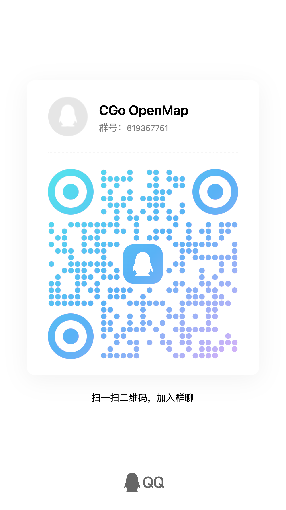

# 🚀 CGo OpenMap 新手小白实战手册：借助 DeepSeek Harness 轻松玩转与开发地铁图

> 💡 **写在前面（给零基础新手的小伙伴）：**  
> 你是不是很想为自己所在的城市制作一张酷炫的**可交互地铁线路图**，但一看到代码（JavaScript、SVG、CSS）就觉得头大？  
> **完全不用担心！** 本项目采用了极其清晰的“数据与引擎解耦”设计，配合 DeepSeek 官方开源的智能体框架 **DeepSeek Harness（`dsh`）**，你**无需任何编程基础**，只需用平常说话的大白话告诉 AI：“*帮我在上海地图上加一条14号线，包含静安寺站和陆家嘴站*”，AI 就会全自动帮你写好数据并排版！
> 
> 本指南将手把手带你从零开始：**安装必备工具 ➔ 配置 DeepSeek Harness ➔ 启动项目 ➔ 指挥 AI 制作你的城市地铁图**！

---

## 📑 目录

- [第一步：准备工作（安装免费工具）](#第一步准备工作安装免费工具)
- [第二步：获取 DeepSeek API 密钥](#第二步获取-deepseek-api-密钥)
- [第三步：安装并配置 DeepSeek Harness](#第三步安装并配置-deepseek-harness)
- [第四步：下载 openmap 项目](#第四步下载-openmap-项目)
- [第五步：一键启动本地预览（看到地图）](#第五步一键启动本地预览看到地图)
- [进阶黑科技：使用 Drunk 智能转换工作台（零代码制图，早期测试版）](#进阶黑科技使用-drunk-智能转换工作台零代码制图早期测试版)
- [第六步：实战教学 —— 指挥 DeepSeek Harness 帮你画地铁图](#第六步实战教学--指挥-deepseek-harness-帮你画地铁图)
- [第七步：小白常见避坑指南 (FAQ)](#第七步小白常见避坑指南-faq)
- [第八步：如何免费把做好的地图发给朋友看](#第八步如何免费把做好的地图发给朋友看)

---

## 第一步：准备工作（安装免费工具）

整个开发过程只需要一个基础工具：**Node.js**（DeepSeek Harness 的运行环境，完全免费）。

### 下载并安装 Node.js
1. 官方下载链接：[https://nodejs.org/](https://nodejs.org/)。
2. 选择 **LTS（长期支持版）**，根据你的电脑系统（Windows / Mac）下载安装包，一路点击“下一步”完成安装即可。
3. 安装完成后，打开终端（Windows 搜“PowerShell”，Mac 搜“终端”），输入下面的命令检查是否装好：
   ```bash
   node -v
   npm -v
   ```
   如果能打印出版本号（例如 `v20.x.x`），就说明安装成功了。

---

## 第二步：获取 DeepSeek API 密钥

DeepSeek 是目前代码能力极强的国产顶级大模型，价格极其亲民（新用户通常赠送免费额度，日常充值几元钱足够使用数月）。

1. 打开 DeepSeek 开放平台官网：[https://platform.deepseek.com/](https://platform.deepseek.com/)
2. 注册并登录你的账号。
3. 点击左侧导航栏的 **“API keys”**。
4. 点击 **“创建 API key”**，给它取一个名字（例如 `openmap-dev`）。
5. 点击创建后，系统会生成一串形如 `sk-xxxxxxxxxxxxxxxxxxxxxxxxxxxxxxxx` 的密钥。
6. ⚠️ **重要**：点击“复制”并把它保存在一个临时备忘录中（该密钥只显示一次）。

---

## 第三步：安装并配置 DeepSeek Harness

DeepSeek Harness（`dsh`）是 DeepSeek 官方开源的智能体框架，能直接在你的电脑上读写文件、执行命令，帮你全自动修改地铁图数据。

### 安装并启动

1. 打开终端（Windows 搜“PowerShell”，Mac 搜“终端”）。
2. 在终端中输入下面的命令，即可通过 `npx` 直接运行（无需手动安装，首次运行会自动下载）：
   ```bash
   npx @deepseek-ai/dsh web
   ```
3. 首次运行时它会自动下载所需文件，稍等片刻后，DeepSeek Harness 的 **Web 界面**会默认在 `http://127.0.0.1:3080` 启动，并自动在浏览器中打开。
4. 首次进入 Web 界面时，会弹出 **“添加一个 API Key 开始使用”** 的引导框：
   - 在 **API 密钥** 输入框中，粘贴刚才在 DeepSeek 平台复制的 `sk-xxxx` 密钥；
   - 点击 **“保存并继续”**。
5. 🎉 配置完成！你现在拥有了全天候在线的 DeepSeek 智能体助手。

> 💡 **配置 API 密钥的另一种方式（命令行）**：  
> 你也可以直接通过环境变量把密钥传给 Harness，然后重启 Web 界面：
> ```bash
> export DEEPSEEK_API_KEY="你的sk-密钥"
> npx @deepseek-ai/dsh web
> ```
> 模型默认使用 `deepseek-v4-flash`（速度快、性价比高），也支持 `deepseek-v4-pro` 等更强大的模型。

---

## 第四步：下载 openmap 项目

1. **获取项目代码**：
   - 如果你是在 GitHub 上看到本项目，点击绿色的 **`Code` ➔ `Download ZIP`**，将压缩包解压到你的电脑文件夹中（例如 `D:\Projects\openmap` 或 `~/Documents/openmap`）。
   - 或者使用 Git 命令克隆：
     ```bash
     git clone https://github.com/NokiaimuL/CGo-OpenMap.git
     ```
2. 解压后你会看到 `index.html`（欢迎首页门户）、`main.html`（线路图交互画布）、`core/`、`city/`、`css/` 等所有文件，**记住这个文件夹的路径**，后面的步骤会用到它。

---

## 第五步：一键启动本地预览（看到地图）

⚠️ **新手最容易踩的坑**：*为什么直接在电脑文件夹里双击 `index.html` 或 `main.html` 打开是白屏或图标不显示？*  
- **原因**：现代浏览器出于安全策略，禁止直接通过本地文件协议（`file://`）加载模块化脚本与 SVG 资源。必须通过本地 HTTP 服务器运行！

### 启动方法：
1. 打开终端，进入 openmap 项目文件夹：
   ```bash
   cd D:\Projects\openmap      # Windows 示例
   # 或 Mac：
   # cd ~/Documents/openmap
   ```
2. 运行下面这条命令，临时启动一个本地静态服务器：
   ```bash
   npx serve .
   ```
3. 终端会打印一个本地地址（例如 `http://localhost:3000`），用浏览器打开它。
4. 🎉 此时你就能看到欢迎首页门户，展示所有入驻城市及负责人信息！点击任意城市卡片（或直接访问 `http://localhost:3000/main.html?city=shenyang`），就能看到丝滑流畅的轨道交通线路图，试着用鼠标滚轮缩放、拖拽、搜索车站。

---

## 进阶黑科技：使用 Drunk 智能转换工作台（零代码制图，早期测试版）

> [!WARNING]
> **早期开发验证阶段声明**：  
> **Drunk 系统目前处于早期开发验证阶段（Beta 1），仅供测试与实验使用**。系统算法仍在持续优化迭代，生成的数据建议在浏览器中实际加载验证。**非常欢迎广大开发者和小伙伴共同体验并参与协同开发！**

如果你觉得用大白话一个站一个站告诉 AI 录入依然比较耗时，强烈推荐试试项目自带的 **Drunk 智能转换工作台**（位于 `drunk/` 目录）：

1. **进入工作台**：本地启动静态服务后，在浏览器中打开 `http://localhost:3000/drunk/`（或在首页导航栏点击进入）；
2. **上传任意底图**：直接把你们城市的地铁线路图图片（PNG/JPG）、矢量 PDF 甚至 Adobe Illustrator (`.ai`) 文件拖入工作台；
3. **AI 视觉与矢量提取**：
   - 点击右上角「API 设置」填入你的 DeepSeek API Key（仅保存在你本地浏览器，单次识图仅约 0.01~0.05 元，本站完全免费）；
   - 点击「视觉识图」（或自动解析 PDF/AI 矢量图层），系统会自动推算全网拓扑，并联网维基百科自动对齐中英文站名；
4. **可视化所见即所得调整**：
   - 滑动「底图透明度」滑块比对原图；
   - 鼠标自由拖动站点圆点微调位置；
   - 选中站点点击右侧「8 方向文字轮盘」，秒级避让交叉线路；
   - 点击「45°/90°吸附」一键修正微小手抖，恢复专业正交斜角；
5. **一键导出代码**：
   点击「导出城市工程」，复制生成的代码，然后直接在 DeepSeek Harness 里对 AI 说：“*请帮我把这些代码保存到对应城市目录*”，整网地铁图瞬间搞定！

---

## 第六步：实战教学 —— 指挥 DeepSeek Harness 帮你画地铁图

现在最激动人心的时刻到了！你不需要自己手敲复杂的数据，把任务交给 DeepSeek Harness 即可。

### 核心秘诀：让 Harness 在你的 openmap 项目目录里工作
1. 在 DeepSeek Harness 的 Web 界面中，点击 **“新建会话”**（或直接开始对话）。
2. 在会话里，先告诉 Harness 你的项目位置，例如：
   > “请在 `D:\Projects\openmap` 目录下工作”（Windows），或 “请在 `~/Documents/openmap` 目录下工作”（Mac）。
3. 再让它先了解项目规范，例如对它说：
   > “请先阅读项目根目录下的 `AGENTS.md` 和 `PORTING.md`，并严格按其中的规范操作。”
4. 之后，直接复制下面的指令模板发给它即可。

---

### 实用指令模板库（复制即用）

#### 场景 1：为你的家乡城市创建新地图骨架（以制作“上海地铁”为例）
> **你发给 DeepSeek 的提示词：**
> ```text
> 你好！我想基于本项目为“上海”制作一张地铁线路图。
> 请阅读 AGENTS.md 和 PORTING.md 中的规范：
> 1. 请在 city/ 目录下帮我创建 city/shanghai/ 目录；
> 2. 在 city/data.js 的 CITY_REGISTRY 中帮我注册上海的基础信息（画布大小设为 2200x1800，中心点设为 1000, 800）；
> 3. 帮我生成基础的 data_stations.js 和 data_lines.js 模板；
> 4. 告诉我如何在 main.html 底部切换引入上海的脚本（或通过 main.html?city=shanghai 访问）。
> ```

---

#### 场景 2：添加一条新线路和站点
> **你发给 DeepSeek 的提示词：**
> ```text
> 请帮我在 city/shanghai/data_stations.js 中添加以下 3 个车站：
> - 人民广场 (ID: "M101", 坐标 x: 1000, y: 800, 类型: tsf换乘站, 文字在右上 top-right)
> - 黄陂南路 (ID: "M102", 坐标 x: 1000, y: 880, 类型: dot普通站, 文字在右侧 right)
> - 陕西南路 (ID: "M103", 坐标 x: 1000, y: 960, 类型: tsf换乘站, 文字在右侧 right)
> 
> 然后在 data_lines.js 中创建 1 号线，将这 3 个车站按顺序连起来，线路颜色设为 "#E4002B"，站间距分别设为 1200米 和 1100米。
> ```

---

#### 场景 3：站名和线路打架了？让 AI 帮你微调排版
> **你发给 DeepSeek 的提示词：**
> ```text
> 我在浏览器预览时发现，“黄陂南路站”的文字和旁边的一条垂直线重叠了。
> 请帮我把 data_stations.js 中 M102 的 align 属性改成 "left"（文字显示在圆点左侧），并将 offset.x 调整为 -6。
> ```

---

#### 场景 4：帮我检查数据有没有填错
> **你发给 DeepSeek 的提示词：**
> ```text
> 我刚才手动修改了 data_lines.js 和 data_stations.js，请根据 AGENTS.md 中的“数据完整性自检清单”，帮我全面检查：
> 1. 每条线路的 distances 数组长度是否严格等于 stationIds.length - 1？
> 2. stationIds 里的所有车站 ID 是否都在 data_stations.js 里定义过？
> 3. 是否有坐标重叠或未闭合的环线？
> ```

---

#### 场景 5：为车站定制文旅、时刻、进站时间、换乘接驳或便民设施等信息板模块
> **你发给 DeepSeek 的提示词：**
> ```text
> 我想为我的城市线网定制车站信息板的专属特色模块：
> 1. 请参考 docs/STATION_MODULE_GUIDE.md，在 city/{city_id}/modules/ 下帮我新建一个定制模块；
> 2. 我希望能根据车站特点展示：
>    - 历史文旅名胜指引（如名胜古迹、红色旅游）；
>    - 运行时刻与列车预计进站时间看板；
>    - 换乘详情走行耗时与地面微循环公交接驳空间；
>    - 站台立体结构与母婴室/AED 设施指南；
> 3. 帮我在 city/{city_id}/{city_id}.js 中配置该模块的启用状态、排序权重与挂载选项卡，并用 document.write 同步加载；
> 4. 记得帮我在 sw.js 中登记新脚本并更新缓存版本号！
> ```

---

## 第七步：小白常见避坑指南 (FAQ)

### Q1：我在代码里改了站名或数据，但在浏览器里刷新，为什么还是旧的内容？
- **核心原因**：**一定要更新 Service Worker，否则更改可能不会生效！** 本项目内置了 PWA Service Worker 离线强缓存功能，浏览器会优先读取本地已缓存的文件。
- 💡 **排错第一准则**：在修改代码后，**如果出现了“怎么修改都不起作用、刷新页面毫无反应”的现象，请务必首先思考是否是 Service Worker 缓存导致的可能性！**
- **彻底解决方法**：
  - **代码层面（规范做法）**：打开 `sw.js`，将顶部的 `CACHE_NAME` 版本号递增（例如由 `'cgo-openmap-v260904.010000'` 改为 `'cgo-openmap-v260904.020000'`），通知浏览器拉取最新资源。
  - **调试层面（即时生效）**：
    - **方法一（推荐调试手段）**：按键盘 `F12` 打开开发者工具，在 **Network（网络）** 标签页勾选 **`Disable cache (停用缓存)`**（只要开发者工具开着，所有请求都实时穿透缓存直接获取最新代码）。
    - **方法二（硬性强制刷新）**：按键盘上的 **`Ctrl + F5`**（Windows）或 **`Cmd + Shift + R`**（Mac）。
    - **方法三（应用内置清理）**：点击网页右上角的「设置」（⚙️ 图标），点击“清除本地缓存并刷新”。
    - **方法四（注销缓存）**：在 F12 开发者工具的 **Application（应用）-> Service Workers** 面板中点击 **`Unregister`（注销）** 或勾选 **`Update on reload`**。

### Q2：我想给线路换个颜色或者换个图标，怎么弄？
- 在 `data_lines.js` 对应线路里：
  - 修改 `color: "#你的颜色Hex代码"`（例如 `#FF0000` 是红色）。
  - 内置图标可以直接写 `svg: "icon@01.svg"`（数字 01 到 57 都有内置模板，颜色会自动与 `color` 联动同步，不需要自己画图；详细编号与线路对应关系参见 [assets/svg/README.md](assets/svg/README.md)）。

### Q3：换乘车站怎么处理？
- 在 `data_stations.js` 中将车站的 `type` 设置为 `"tsf"`（Transfer 换乘站简写）。
- 如果多条线路在同一个站换乘，两条线路在 `data_lines.js` 的 `stationIds` 里直接填**同一个车站 ID**（例如都是 `"M101"`）即可，地图会自动绘制换乘标志圈并连接！

---

## 第八步：如何免费把做好的地图发给朋友看

当你制作好属于你城市的地图后，可以免费使用 **GitHub Pages** 将它发布到公网：

1. 将你的项目上传到 GitHub 仓库。
2. 进入仓库页面的 **Settings（设置）**。
3. 在左侧菜单点击 **Pages**。
4. 在 **Build and deployment** 下的 **Source** 选项中选择 `Deploy from a branch`。
5. Branch 选择 `main`（或 `master`），文件夹选择 `/ (root)`，点击 **Save**。
6. 等待 1~2 分钟，GitHub 就会为你生成一个形如 `https://yourname.github.io/openmap/` 的专属网址！
7. 把链接发给小伙伴，或者在手机微信/Safari 中打开，还能直接点击“添加到主屏幕”当成独立 App 使用！

---

## 💬 遇到问题？加入官方答疑群

如果在操作过程中遇到任何疑问、配置报错或想交流制图经验：
- **官方 QQ 交流群**：**619357751**
- **快速入群链接**：[👉 点击一键加群](https://qm.qq.com/q/nHfgBDS68o)
- **扫码加入**：

<p align="center">
  
</p>

祝你借助 DeepSeek Harness 和 CGo OpenMap 玩得开心！如有任何疑问，欢迎随时在群里或 GitHub Issue 交流讨论 🚇✨